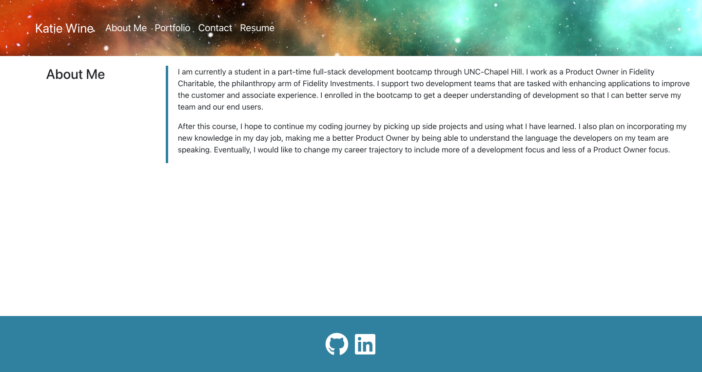
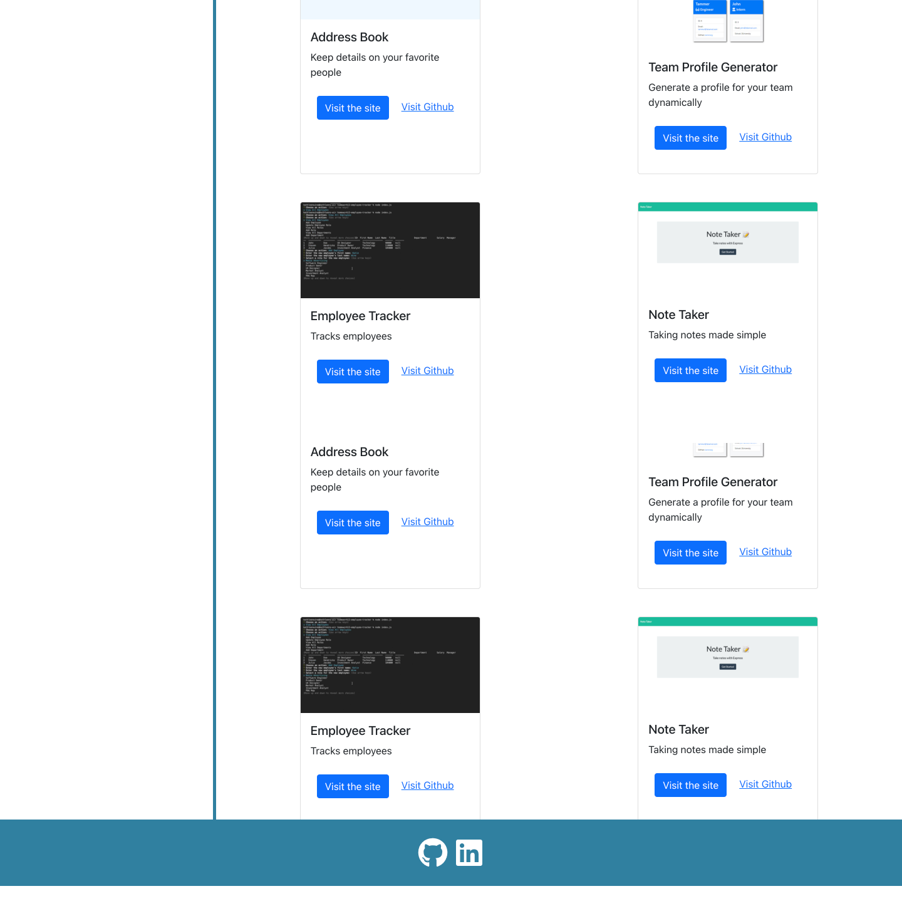
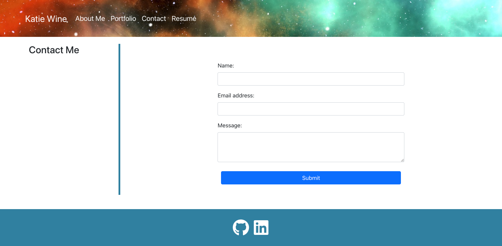
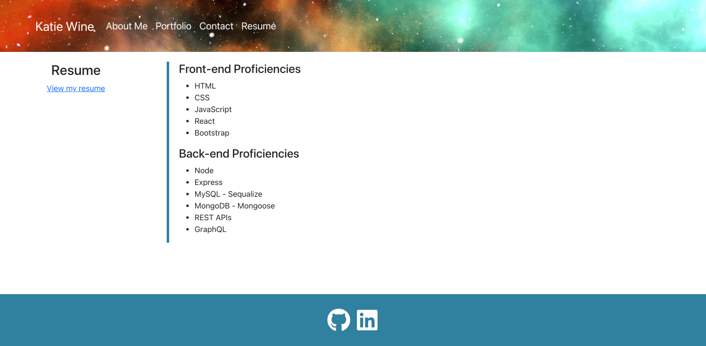

Homework 20 - React Portfolio

## Description

This project is a React Portfolio that showcases all of the work I have completed throughout the course. There are different sections so that potential employers can view information about me, look at projects that I have completed, contact me or view my resume.

## Table of Contents

- [Installation](#installation)
- [Usage](#usage)
- [License](#license)
- [Contributing](#contributing)
- [Tests](#tests)
- [Questions](#questions)

## Installation

To install the necessary dependencies, run the following command:
npm i

## Usage

Repo instructions: Once all of the dependencies have been installed, run "npm run start" from the terminal and it will run on localhost:3000.

## License

This project doesn't have a license.

## Contributing

Contributing is not allowed at this time.

## Tests

There are no tests at this time.

## Questions

If you have any questions about the repo, reach out to me directly at katie.wine2@gmail.com. See more of my work at https://www.github.com/kmwine02

## Links

The repo can be found here: https://github.com/kmwine02/homework20-react-portfolio
The live site can be found here: https://kmwine02.github.io/homework20-react-portfolio/

